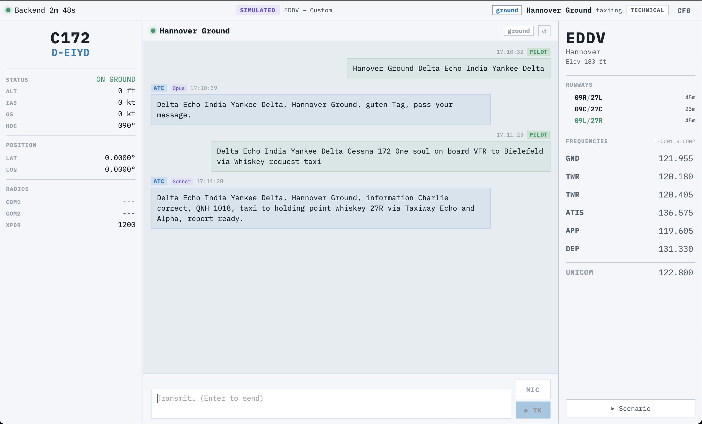
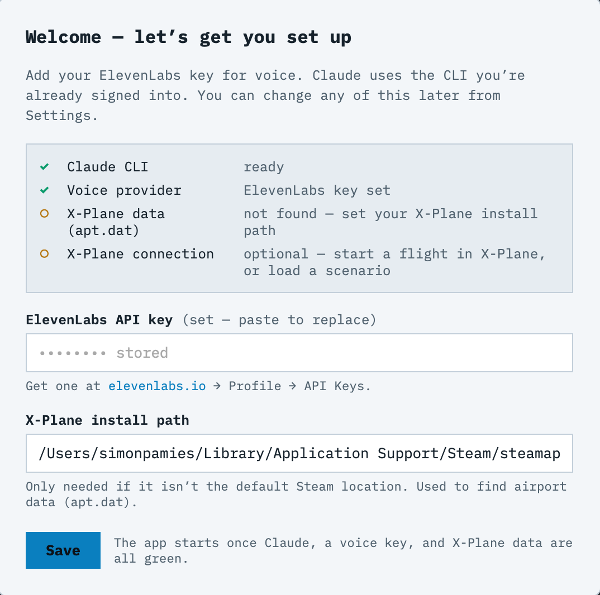

# X-Plane Virtual ATC

**Talk to a real-sounding air traffic controller while you fly [X-Plane 12](https://www.x-plane.com/).** Hold a button, say what you'd say on the radio, and a controller — powered by Claude — answers in a proper radio voice: taxi clearances, the runway in use, frequency handoffs, squawk codes, the works. It reads your actual position, altitude, and radios from the sim, and knows the real layout of the airport you're at.



## What you need

The defaults are built around two paid/account services. Both are required for the normal experience:

- **A Mac** (Apple Silicon or Intel) and **X-Plane 12**.
- **A Claude subscription** ([claude.ai](https://claude.ai)) — the controller's brain. You sign in through the `claude` CLI during setup; there is no API key to paste.
- **An ElevenLabs API key** — the default voice provider. With the defaults, ElevenLabs handles **both** the controller's voice (text-to-speech) **and** transcribing what you say (speech-to-text). Create a key at **[elevenlabs.io/app/developers/api-keys](https://elevenlabs.io/app/developers/api-keys)** and give it these permissions (or leave the key unrestricted):

  | Permission | Access | Why it's needed |
  |---|---|---|
  | Text to Speech | enabled | the controller's spoken voice |
  | Speech to Text | enabled | transcribes your push-to-talk radio calls |
  | User | read only | lets the app verify the key works on startup |

  You paste this key into the app's **Settings** screen (not into any file).

> Prefer not to use ElevenLabs? You can switch to OpenAI, or fully local STT/TTS (Whisper + Piper) — see [Configuration](#configuration). The steps below assume the ElevenLabs defaults.

## Download the app (Mac — easiest)

A prebuilt macOS app is published on the [Releases page](https://github.com/spamsch/xplane-virtual-atc/releases). It includes the desktop app already built — no Node, Rust, or building required.

1. Download `X-Plane-Virtual-ATC-macOS.zip` from the latest release and unzip it.
2. **Run `setup.command` from Terminal — once.** Because the download is unsigned, macOS blocks double-click *and* right-click → Open on it. Instead: open **Terminal** (press ⌘-Space, type `Terminal`, Return), then **drag `setup.command` into the Terminal window and press Return**. It installs Python and Claude (may ask for your Mac password); when prompted, type `claude` to sign in, then `exit`. This also clears the macOS block on the app and on `start.command`.
3. From then on, just **double-click `start.command`**. The app window opens on its own; keep the small black window open while you fly, and quit the app to stop.

`READ ME FIRST.txt` in the zip has the same steps plus troubleshooting. You still need everything under [What you need](#what-you-need) above — a Claude subscription and an ElevenLabs key (with the permissions listed there), which you paste into the app's Settings.

On first launch the app opens its **Settings** screen — a live checklist that shows exactly what's still needed and where to paste your ElevenLabs key:



## Build it yourself (Mac — from source)

Prefer to run from source, or on another platform? Same requirements as [What you need](#what-you-need) above — a **Claude subscription** and an **ElevenLabs API key** with the listed permissions.

**Install it once:**

1. **Download the app.** At the top of [this page](https://github.com/spamsch/xplane-virtual-atc), click the green **Code** button → **Download ZIP**. Double-click the downloaded ZIP to unpack it, and open the new folder.
2. **Run `setup.command` from Terminal.** A downloaded ZIP is unsigned, so macOS blocks double-click and right-click → Open. Open **Terminal** (⌘-Space, type `Terminal`, Return), then **drag `setup.command` into the window and press Return**. A black window installs everything — it may ask for your Mac password and take a few minutes. Wait until it says **"App ready."**
3. **Sign in to Claude.** In that same black window, type `claude` and press Return, follow the sign-in that opens in your browser, then type `exit` and press Return.
4. **Get your ElevenLabs key.** Go to [elevenlabs.io/app/developers/api-keys](https://elevenlabs.io/app/developers/api-keys), sign in, click **Create API key**, and grant it **Text to Speech**, **Speech to Text**, and **User: read** (or leave it unrestricted) — see [What you need](#what-you-need). Copy the key.

**Each time you want to fly:**

1. Start **X-Plane** and begin a flight. (No sim handy? You can fly a built-in scenario instead — pick one in the app.)
2. **Double-click `start.command`.** Your web browser opens the app. Keep that black window open while you fly; closing it stops the app.
3. The first time, the app shows a **Settings** screen. Paste your **ElevenLabs key**, check the **X-Plane path** is right, and click **Save**.
4. **Talk to ATC:** hold the **PTT** button on screen (or hold the **Spacebar**) and speak. Let go to send. Your browser will ask to use the microphone the first time — click **Allow**.

**Trouble?**
- *"can't be opened" / "unidentified developer", or `start.command` won't run* → you haven't run `setup.command` yet. Open Terminal, drag `setup.command` in, press Return (right-click → Open does **not** work on unsigned `.command` files). It clears the block on the app and `start.command`.
- *The Settings screen won't go green* → it lists what's missing (Claude, voice key, or X-Plane path). Fix that item; the X-Plane path field lets you point at your install if it isn't the default.
- *No controller voice* → make sure you pasted the ElevenLabs key in Settings.

> **Status:** Departure and ground/tower phases are solid. En-route and arrival handling is partially implemented. VFR only.

## What it does

- **Reads your real flight state** from X-Plane — position, altitude, heading, COM frequencies, transponder, aircraft type, and registration — over the REST API (X-Plane 12.1+) or classic UDP.
- **Knows the airport.** Parses X-Plane's `apt.dat`, builds a spatial index, and auto-detects the nearest field as you taxi or fly. The controller works from the actual runways, frequencies, and elevation.
- **Talks like a controller, not a chatbot.** Claude decides the active runway and station callsign once per airport (Opus), then handles the back-and-forth (Sonnet for routine, Opus for the first call to each station).
- **Drives a real state machine.** Phase and station transitions are triggered by keyword matching on the controller's output — the LLM suggests, the state machine decides. Squawk lifecycle, frequency handoffs, and the 10 flight phases are all deterministic, so behavior stays predictable even when the model gets creative.
- **Handoffs you actually have to fly.** When live in X-Plane, a station the controller hands you off to won't answer until you've tuned COM1 to its frequency — call early and you get "no reply, set COM1 to…" instead of a free pass.
- **Push-to-talk that feels right.** Key the mic from the UI, the spacebar, or a bound X-Plane control. You get a mechanical relay *clack* on key and a squelch-tail hiss on unkey, synthesized in the browser.
- **Voice in and out.** Optional speech-to-text (ElevenLabs Scribe, OpenAI, or a local ATC-fine-tuned Whisper model) and text-to-speech (ElevenLabs, OpenAI, Piper, or macOS `say`). Before synthesis the text is normalized to spoken radio form (`D-EIYD` → "Delta Echo India Yankee Delta", `27R` → "two seven Right"), then a radio-DSP pass band-limits the voice and adds VHF hiss. Pick the controller's voice by name from a curated list (or any ElevenLabs id).
- **A frequency that isn't dead air.** With X-Plane connected, other aircraft work the same controller in the background — startup and taxi on Ground, the circuit and clearances on Tower, inbound calls on Approach, flight-information chatter en route. The traffic matches the frequency you're tuned to (no Tower calls on Ground), fits the airport's size, and runs on a single half-duplex channel so nothing keys over your reply. It goes silent the instant you press to talk — and afterwards the controller sometimes works one other aircraft before turning back to you. Each aircraft gets its own voice (drawn from a pool of ten) and its own radio character. Density is off / light / medium / heavy; the scripts are JSON you can edit or add to. VFR only for now.
- **Knows the airspace you're in.** X-Plane doesn't expose controlled airspace, so the controller pulls it from [OpenAIP](https://www.openaip.net/): it knows you're in the *Hannover CTR, Class D, surface to 2500 ft*, reflects that in what it says, and won't hand you off to a neighbouring field while you're still inside the zone or haven't been released. The country file downloads once (~3 MB) and is cached; offline it falls back to a distance estimate.
- **Knows when the sim is there.** The status bar shows a live X-Plane link indicator (LINKED / NO LINK), and PTT only listens while the sim is actually connected.

## How it works

Three layers compose cleanly: a **data source**, an **ATC session engine**, and a **transport**.

```
┌─────────────────┐     ┌──────────────────┐     ┌─────────────────────┐
│  Data source    │     │  ATC engine      │     │  Transport          │
│                 │     │                  │     │                     │
│  X-Plane        │ ──▶ │  ATCSession      │ ──▶ │  WebSocket server   │
│  (REST or UDP)  │     │  state machine   │     │  + Tauri/Svelte UI  │
│       or        │     │  + claude CLI    │     │       or            │
│  Scenario sim   │     │  (Opus / Sonnet) │     │  terminal CLI       │
└─────────────────┘     └──────────────────┘     └─────────────────────┘
```

- **Data source** — `xplane/rest_connector.py` (REST, the default for X-Plane 12.1+), `xplane/connector.py` (UDP/RREF), or `xplane/simulator.py` (scenario replay). All three satisfy the same informal `FlightDataSource` protocol — a `.state` property returning a `FlightState`. Everything downstream is source-agnostic.
- **Airport data** — `airport/parser.py` streams and parses `apt.dat` (~500 MB) once and caches a pickle next to it. `airport/database.py` wraps it with a 1°×1° spatial grid for O(1) candidate lookup and haversine ranking.
- **ATC engine** — `atc/session.py` is the state machine (10 phases, 6 station types, squawk lifecycle, handoff detection). `atc/engine.py` wraps the `claude` CLI: a `boundary_check` call (Opus) determines the active runway and controller callsign per airport, then `respond` generates each transmission.
- **Ambient traffic** — `traffic/library.py` holds a JSON library of scripted other-aircraft exchanges, filtered by station, airport size, and flight rules; `traffic/ambient.py` paces them by level (light/medium/heavy). It's pure and stdlib-only — the backend renders the lines, voices them, and plays them through the same radio-DSP and the same half-duplex channel as the controller, so the party line never talks over your reply.
- **Transport** — `backend/server.py` is an asyncio WebSocket server that polls flight state, detects airport changes, and fans LLM calls out to a thread pool. `main.py` is the synchronous CLI doing the same flow without the WebSocket machinery. The UI in `ui/` is a Tauri 2 app wrapping a Svelte 5 frontend with auto-reconnect.

Design notes live in [`CLAUDE.md`](CLAUDE.md).

## Requirements

- **X-Plane 12** with the local web API enabled (Settings → Network → *Enable local network access* / web server), or UDP data output. The REST connector targets port `8086`.
- **[Claude Code CLI](https://claude.ai/code)** installed and authenticated — the engine shells out to `claude -p`.
- **Python 3.9+** (developed against 3.14). The core runtime is standard-library only.
- **Node + npm** for the desktop UI; the Rust/Tauri toolchain if you want to build a native bundle.

## Developer setup

If you have the toolchain (these need Xcode Command Line Tools — `xcode-select --install` — which provide `make`, plus Python and Node):

```bash
make setup     # venv + Python deps + UI deps + .env, and checks for the claude CLI
make dev       # backend + the desktop (Tauri) app together
# or:
make dev-web   # backend + browser UI at http://localhost:1420 (no Rust toolchain)
```

(The double-click `setup.command` / `start.command` in the Quick start above do the same thing for non-developers, installing the toolchain via Homebrew first.)

On first launch the app opens a **Settings view** with a checklist (the "doctor"): paste your ElevenLabs API key, confirm your X-Plane path, and you're flying. Claude needs nothing here — it uses the `claude` CLI you're already signed into. No file editing required; the key is saved to `.env` for you.

Then start a flight in X-Plane (the backend auto-detects it within ~2 s), or load a scenario from the UI to fly without the sim.

The default install is small — `requirements.txt` is just `websockets`, `numpy`, `scipy`. The ElevenLabs voice path needs no model download.

### Terminal CLI

```bash
python3 main.py                              # requires X-Plane running
```

### Offline voice (optional)

By default voice runs on ElevenLabs (cloud). For fully local STT/TTS — or the CLI's mic capture — install the extras **and opt in explicitly**:

```bash
pip install -r requirements-local.txt        # faster-whisper, piper-tts, sounddevice
export STT_BACKEND=local                      # offline Whisper (~1.6 GB on first use)
export TTS_BACKEND=piper                       # offline Piper voices
```

`auto` only ever selects a cloud provider — ElevenLabs (if `ELEVENLABS_API_KEY` is set) → OpenAI (if `OPENAI_API_KEY`) → macOS `say` for TTS. It **never** downloads a local model on its own; offline Whisper/Piper/Kokoro are opt-in via `STT_BACKEND` / `TTS_BACKEND`. See [Configuration](#configuration).

### Tests

The suite is fully mocked — no X-Plane and no live Claude needed.

```bash
pip install -r requirements-dev.txt
pytest tests/                                # 500 tests
pytest tests/test_session.py -v              # one file
pytest tests/ -k squawk                      # by name
```

## Configuration

The easiest path is the in-app **Settings view** (gear icon, top-right) — it shows a live checklist and writes your keys to `.env` for you. Everything below can also be set by hand via environment variables or a `.env` file in the project root (gitignored — never committed). Copy `.env.example` to `.env` to start.

| Variable | Default | Purpose |
| --- | --- | --- |
| `XPLANE_IP` | `127.0.0.1` | X-Plane host |
| `XPLANE_REST_PORT` | `8086` | X-Plane REST/WebSocket API port |
| `XPLANE_PATH` | Steam default | X-Plane install dir (to locate `apt.dat`) |
| `XPLANE_PTT_DATAREF` | *(empty)* | PTT source — see [Push-to-talk](#push-to-talk) |
| `AUDIO_ENABLED` | `true` | Enable STT/TTS voice I/O |
| `TTS_BACKEND` | `auto` | `elevenlabs` \| `openai` \| `kokoro` \| `piper` \| `say` |
| `TTS_VOICE` | `onyx` | Voice name (backend-specific; ElevenLabs uses `ELEVENLABS_VOICE_ID`) |
| `STT_BACKEND` | `auto` | `elevenlabs` \| `openai` \| `local` |
| `STT_MODEL` | `large-v3` | Local Whisper model, or a CTranslate2 path |
| `OPENAI_API_KEY` | *(empty)* | Enables OpenAI STT/TTS when set |
| `ELEVENLABS_API_KEY` | *(empty)* | Enables ElevenLabs STT + TTS; preferred by `auto` when set |
| `ELEVENLABS_TTS_MODEL` | `eleven_flash_v2_5` | TTS model — flash is the low-latency choice for live ATC |
| `ELEVENLABS_VOICE_ID` | `daniel` | Controller voice — a name from the curated list (`daniel`, `brian`, `george`, …) or any raw voice id |
| `ELEVENLABS_TTS_SPEED` | `1.2` | Speech rate, 0.7–1.2 (1.2 = max; the brisk cadence of a busy controller) |
| `ELEVENLABS_STT_MODEL` | `scribe_v1` | Scribe transcription model (`scribe_v1` / `scribe_v2`) |
| `AMBIENT_TRAFFIC_LEVEL` | `medium` | Background traffic density — `off` \| `light` \| `medium` \| `heavy` |
| `AMBIENT_TRAFFIC_RULES` | `VFR` | Flight rules the traffic flies — `VFR`, or `VFR,IFR` to mix in airliners |
| `AMBIENT_PILOT_VOICES` | *(empty)* | Override the other-pilots voice pool; empty = backend default (10 voices on ElevenLabs) |
| `AMBIENT_LIBRARY_DIR` | *(empty)* | Extra interaction `*.json` files, merged over the built-in library |
| `AIRSPACE_ENABLED` | `true` | Load OpenAIP airspace (real CTR awareness); `false` = offline, distance estimate |

### Speech providers

With `ELEVENLABS_API_KEY` set, `auto` selects ElevenLabs for both STT and TTS — the lowest-latency option (measured ~0.4 s TTS, ~1 s STT on short ATC lines). TTS defaults to the fast `eleven_flash_v2_5` model, a steady broadcaster voice, and a slightly quick 1.2× rate; pick any voice id from the [ElevenLabs voice library](https://elevenlabs.io/app/voice-library). STT uses ElevenLabs Scribe. Because flash has no pronunciation controls, the spoken text is normalized first (callsigns → NATO, frequencies/squawks/QNH → spoken digits) so any backend reads it like a controller — German place names are left intact.

**On the LLM:** ATC *text* is still generated by the `claude` CLI, not ElevenLabs. ElevenLabs has no single-turn text-completion endpoint; its only text-in/text-out REST path (the agent `simulate-conversation` eval endpoint) runs ~7 s and synthesizes its own user persona rather than answering a given transmission. Its production LLM path is the realtime voice agent, which would replace the deterministic state machine — not a fit here. So: ElevenLabs for voice, Claude for decisions.

### Background traffic

When you're connected to X-Plane, the frequency carries other aircraft talking to the same controller. It's on by default at `medium` — set `AMBIENT_TRAFFIC_LEVEL` to `off`, `light`, or `heavy` (in the app, the Settings view has a selector; the level is saved to `.env`). The level controls three things: how long the frequency stays quiet between exchanges, how often the controller works one other aircraft right after you transmit before answering you, and how much background radio atmosphere (squelch breaks, static, faint distant chatter) fills the gaps so the frequency never sounds dead.

What you hear is matched to the moment. The script library is filtered by the station you're actually tuned to (Ground / Tower / Approach / Radar / FIS, read from your live COM1, so Tower traffic never appears on Ground — and Radar/Departure at a bigger field is distinct from the en-route Information service), by the airport's size (a sleepy GA strip gets less and simpler chatter than a large controlled field), and by flight rules. It's VFR-only by default; `AMBIENT_TRAFFIC_RULES=VFR,IFR` mixes airline traffic in at a field, and en route is always VFR. Keying the mic cuts the traffic immediately — a radio is half-duplex.

The chatter scripts are plain JSON in [`traffic/interactions/`](traffic/interactions) — one file per station, each a short multi-line exchange with `{placeholders}` (callsign, runway, QNH, …). Edit them, or drop your own `*.json` into a folder and point `AMBIENT_LIBRARY_DIR` at it; your files merge on top of the built-ins. Each aircraft is given a voice from a pool (ten ElevenLabs voices by default, deliberately excluding the controller's), seeded by its callsign so it stays consistent, plus a randomised radio character — passband, AM drive, hiss, level, and crackle drawn from wide ranges so the party line spans crisp local sets through to weak, distant, badly-fried ones. Override the pool with `AMBIENT_PILOT_VOICES`.

### Push-to-talk

PTT is watched over the X-Plane WebSocket API for instant press/release edges (no polling lag). `XPLANE_PTT_DATAREF` auto-detects whether you've named a **dataref** or a **command**:

- **Recommended — a dataref that holds while pressed**, e.g. `xpilot/ptt` (from the [xPilot](https://docs.xpilot-project.org/) plugin). Bind your key to the *"xPilot: Radio Push-to-Talk"* command; the dataref then stays `1` for the whole press. A raw joystick button like `sim/joystick/joystick_button_array[32]` also works.
- **Commands** (e.g. `sim/operation/contact_atc_ptt`) resolve too, but most ATC command bindings fire as a one-shot *pulse* — press and release in the same instant — so hold-to-talk won't capture audio. Use a dataref instead.

Leave `XPLANE_PTT_DATAREF` empty to drive PTT from the on-screen button or the spacebar.

## Project layout

```
backend/      asyncio WebSocket server (transport)
main.py       synchronous CLI (transport)
atc/          session state machine + claude CLI wrapper + radio-call parser
xplane/       REST connector, UDP connector, scenario simulator
airport/      apt.dat parser + spatial database
aircraft/     aircraft type lookup
audio/        STT, TTS, and radio DSP
airspace/     OpenAIP airspace loader + point-in-polygon (CTR awareness)
traffic/      ambient party-line library + pacing (interactions/*.json)
scenarios/    JSON scenarios for the simulator data source
ui/           Tauri 2 + SvelteKit 5 desktop app
tests/        500 mocked tests
```

## License

[MIT](LICENSE) © 2026 Simon Pamies.

Not affiliated with Laminar Research or X-Plane.

Airspace data © [OpenAIP](https://www.openaip.net/) contributors, used under
[CC BY-NC 4.0](https://creativecommons.org/licenses/by-nc/4.0/). Downloaded at
runtime when airspace awareness is enabled; not redistributed with this repo.
